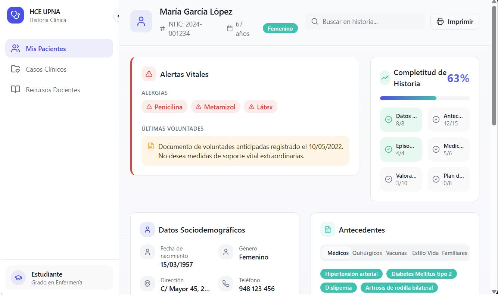

# 🏥 HCE Docente: Plataforma de Historia Clínica Electrónica

> **Status:** 🚧 Active Development (Hybrid AI-Engineering Pipeline)
> **Contexto:** Trabajo de Fin de Grado (TFG) - Universidad Pública de Navarra

Plataforma SaaS diseñada para la docencia médica. Permite la gestión de episodios clínicos, constantes vitales y prescripción, diseñada bajo estándares de interoperabilidad sanitaria (FHIR) y privacidad GDPR.

---

## ⚡ Metodología: "Human-in-the-Loop Engineering"

Este proyecto implementa un flujo de trabajo moderno de **Desarrollo Asistido por IA**, donde actúo como Arquitecto de Software y Auditor de Calidad, orquestando herramientas generativas para acelerar el "Time-to-Market".

### El Pipeline de Desarrollo
El código se genera y valida mediante un ciclo estricto:

1.  **Definición (Human):** Diseño de requisitos clínicos, esquema de base de datos y prompts de arquitectura.
2.  **Generación (AI Agents):** Prototipado rápido de interfaces (UI) y lógica repetitiva mediante LLMs y herramientas de GenUI.
3.  **Auditoría & QA (Human):** Validación manual de la lógica clínica, seguridad (RLS) y refinamiento del código en entorno local.

---

## 📸 Arquitectura & Visuales

### 1. Arquitectura Técnica (Serverless + FHIR)
*Diseño de sistema desacoplado. React en el frontend, Supabase como BaaS y un túnel de datos estructurados.*


### 2. Dashboard Clínico (Target UX)
*Interfaz diseñada para reducir la carga cognitiva del médico: Alertas vitales y acceso rápido a historia.*


### 3. Acceso Seguro
*Sistema de autenticación y roles integrado con Supabase Auth.*


---

## 🛠 Tech Stack

### Core & Infraestructura
* **Runtime:** Node.js (Local Dev).
* **Build Tool:** Vite (Hot Module Replacement).
* **Control de Versiones:** Git & GitHub.

### Frontend (SPA)
* **Framework:** React 18 + TypeScript.
* **Estilos:** TailwindCSS + Shadcn/ui.
* **Estado:** TanStack Query.

### Backend & Data
* **BaaS:** Supabase (PostgreSQL).
* **Seguridad:** Row Level Security (RLS) para cumplimiento GDPR.
* **Interoperabilidad:** Modelo de datos basado en recursos **HL7 FHIR** (Patient, Encounter, Observation).

---

## 📂 Estructura del Repositorio

Este repositorio contiene la lógica Frontend y la configuración del cliente.

```bash
├── src/
│   ├── components/     # UI Kits (Buttons, Inputs, Tables)
│   ├── pages/          # Vistas (Dashboard, Login, Historia)
│   ├── integrations/   # Cliente Supabase & Tipos DB
│   └── hooks/          # Lógica de React personalizada
├── public/             # Assets estáticos
└── vite.config.ts      # Configuración del bundler